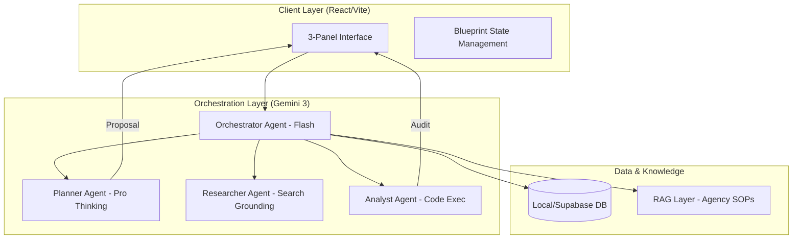

# Sun AI Agency — Implementation Roadmap v1.0

**Status:** ARCHITECTURE LOCKED  
**Role:** Senior Product Architect  
**Goal:** Transition from high-fidelity prototypes to a production-grade AI-orchestrated operations platform.

---

## 1. Executive Summary: Current State vs. Target
| Module | Current State | Target State | Gap |
| :--- | :--- | :--- | :--- |
| **Foundation** | 3-Panel Law implemented. Routing active. | Multi-tenant auth + Persistence. | Auth & DB Sync |
| **CRM** | Intelligence Panels & Table UI. | Researcher Agent with real-time news grounding. | Grounding Tools |
| **Wizard** | 6-Step Intake + Planner Agent logic. | Strategic WBS with resource conflict detection. | Code Execution |
| **Execution** | Task List + Intelligence Sidebar. | Optimizer Agent for real-time task shortcuts. | RAG / Context |
| **Automation** | Blueprint Doc. | Global Orchestration Hub & Ticker. | System Visibility |

---

## 2. System Architecture (Mermaid)

---

## 3. UI/UX Page Inventory

| Route | Screen | Purpose | Core Features |
| :--- | :--- | :--- | :--- |
| `/` | **Home Page** | Conversion & Pitch | Orbital UI, Methodology Reveal, CTA |
| `/app/projects` | **Portfolio** | Ops Visibility | Stream Integrity Bars, Health Scores |
| `/app/crm` | **Signals** | Relationship Intel | Scorer Agent, Grounded News, Follow-up Drafts |
| `/app/wizard` | **Architect** | Intent Capture | Retriever Scan, Thinking Logs, WBS Preview |
| `/app/execution` | **Command** | Task Velocity | Phase Navigation, Optimizer Recommendations |
| `/app/vitals` | **Hub** | Strategy & ROI | Burn Rate Charts, Agent Activity Ticker |

---

## 4. Feature Matrix (Core vs. Advanced)

### 🧱 Core (Phase 1-2)
- **3-Panel Layout:** Strict enforcement of Left (Nav) | Main (Work) | Right (Intel).
- **Planner Agent:** Gemini 3 Pro reasoning to generate multi-phase WBS.
- **Retriever Agent:** Background URL scanning for e-commerce/tech context.
- **Scorer Agent:** Sentiment-based health calculation (0-100).

### 🚀 Advanced (Phase 3-4)
- **Deep Research:** `googleSearch` + `googleMaps` grounding for competitor mapping.
- **Budget Audit:** `codeExecution` (Python) for precise SPI/CPI calculations.
- **Multimodal Briefs:** `gemini-2.5-flash-image` generation for project moodboards.
- **Agency RAG:** Integration of agency-specific SOPs and contracts via retrieval.

---

## 5. User Journeys

### Journey 1: The "Lead-to-Roadmap" Sprint
1. **Trigger:** User adds a LinkedIn URL to CRM.
2. **Researcher:** Agent grounds profile in recent funding news and market trends.
3. **User Action:** Clicks "Generate Strategic Roadmap."
4. **Planner:** Consumes research data and generates an 8-week execution plan.
5. **Controller Gate:** Human reviews WBS, deletes 1 task, and clicks "Launch Project."

### Journey 2: The "At-Risk" Intervention
1. **Trigger:** Scorer Agent detects "Risk" status due to 10 days of communication silence.
2. **Comms Agent:** Drafts a "Reassurance Email" based on project progress (75% complete).
3. **User Action:** Clicks "Edit Draft," adds a personal note, and clicks "Approve & Send."
4. **Outcome:** Relationship score recovers to 80%.

---

## 6. Implementation Roadmap

### Phase 1: Intelligence Grounding (Week 1-2)
- [ ] Connect `googleSearch` to Researcher Agent in `crmService.ts`.
- [ ] Implement `MarketReportView.tsx` for deep industry analysis.
- [ ] Add citation links (Grounding Chunks) to the Intelligence Panels.

### Phase 2: Strategic Orchestration (Week 3-4)
- [ ] Implement `thinkingBudget` (8000 tokens) for the Planner Agent.
- [ ] Build the "Thinking Terminal" UI to show agent reasoning logs.
- [ ] Create multi-agent handoff logic (Researcher -> Planner).

### Phase 3: Financial Control (Week 5-6)
- [ ] Integrate `codeExecution` for the Analyst Agent in `projectGenerator.ts`.
- [ ] Build `AgencyVitals.tsx` with Recharts for burn-down visibility.
- [ ] Implement "Human-in-the-loop" approval buttons for all task commits.

### Phase 4: Production Polish (Week 7-8)
- [ ] Finalize responsive layouts for iPad/Pro tablets.
- [ ] Implement global search across CRM and Projects.
- [ ] Perform "Red Team" testing on agent prompt injections.

---

## 7. Acceptance Tests (Given/When/Then)

**Test 1: Project Intake Grounding**
- **Given:** A valid e-commerce URL is entered in Step 1 of the Wizard.
- **When:** The input is blurred.
- **Then:** The Retriever Agent must pre-populate "Goals" with "Conversion Optimization" and "Integrations" with "Stripe."

**Test 2: Risk Scoring Integrity**
- **Given:** A contact has 0 interactions for 14 days.
- **When:** The Scorer Agent runs analysis.
- **Then:** The status must shift to "Risk" and the Right Panel must propose a "Follow-up" draft.

---

## 8. Verification Checklist

- [ ] **3-Panel Law:** No page has >3 panels or floating sidebars.
- [ ] **Context Sync:** Selecting a row in Main always updates the Right panel.
- [ ] **Thinking Budget:** Gemini 3 Pro has at least 4000 tokens for planning tasks.
- [ ] **Safety:** No AI write actions occur without a "Human Approval" click.
- [ ] **Grounding:** All external data includes source URLs from `groundingChunks`.
- [ ] **Responsiveness:** Dashboard is usable on a 13" laptop without horizontal scroll.

---

## 9. Real-World Use Cases

1. **The Fast-Moving Growth Agency:** Uses the Wizard to spin up high-fidelity SEO roadmaps in 5 minutes instead of 5 hours.
2. **The High-End Design Studio:** Uses the CRM News Grounding to start every client call with a "Recent Win" mention, increasing trust.
3. **The Tech Ops Team:** Uses the Analyst Agent (Code Exec) to find resource leaks across 30 active project streams.

---

## 10. Conclusion: Is this ready to ship?
**Answer:** **NO.**  
**Blockers:** 
1. Real `googleSearch` wiring is currently mocked in `retrieverService.ts`.
2. Python `codeExecution` is not yet implemented for the Budget Analyst.
3. RAG layer (Vector DB) is missing for agency-specific SOP grounding.

**Fix Steps:** Complete Phases 1 and 2 of this roadmap to reach "V1 Production" status.