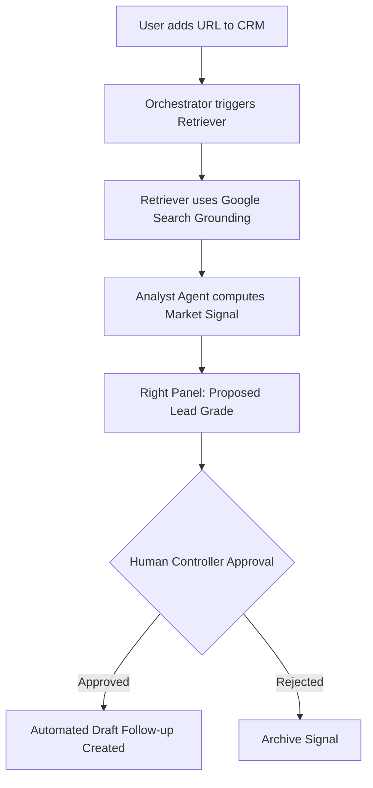

# Sun AI Agency — High-Fidelity Implementation Roadmap v1.2

**Status:** ARCHITECTURE LOCKED  
**Strategic Goal:** Deploy an autonomous-first agency operating system governed by Human Controllers.

---

## 1. Feature → AI Mapping (Production Target)

| Feature | Screen | Model | Gemini Tools | Agents | Inputs | Output | Approval |
| :--- | :--- | :--- | :--- | :--- | :--- | :--- | :--- |
| **Intake Research** | Wizard | G3 Pro | URL Context, Search | Retriever, Orchestrator | URL | Market Profile | Human |
| **WBS Architecting** | Wizard | G3 Pro | Thinking, Struct. Output | Planner, Orchestrator | Goals, Budget | 4-Phase Plan | Human |
| **Proposal Hero** | Dashboard | Nano Pro | Image Gen | Creative Director | Brand Voice | 16:9 Moodboard | Human |
| **Budget Audit** | Right Panel | G3 Pro | Code Execution | Analyst | Task Costs | ROI Report | Human |
| **Status Draft** | Chatbot | G3 Flash | Text Gen | Comms | Task Logs | Client Email | Human |

---

## 2. Implementation Phases

### Phase 1: The Grounding Layer (Weeks 1-2)
*Focus: Connecting the platform to real-world data.*
- [ ] **Task:** Wire `googleSearch` grounding to the CRM "Enrich" button.
- [ ] **Task:** Implement `googleMaps` grounding for lead location mapping.
- [ ] **UI:** Build the "Source Attribution" list in the Right Panel for all grounded claims.
- **Acceptance:** Agent can cite 3 real-world news items for any URL entered.

### Phase 2: The Thinking Engine (Weeks 3-4)
*Focus: Deep architectural reasoning in the Wizard.*
- [ ] **Task:** Implement `thinkingBudget: 16000` for Phase 5 of the Wizard.
- [ ] **UI:** Build the "Thinking Terminal" to display reasoning logs to the user.
- [ ] **Agent:** Orchestrator routes "Market Profile" -> "Planner" -> "WBS Output".
- **Acceptance:** WBS handles complex budget-vs-deadline conflicts with 90% accuracy.

### Phase 3: The Computational Core (Weeks 5-6)
*Focus: Mathematical precision for agency health.*
- [ ] **Task:** Implement `codeExecution` (Python) for the Analyst Agent.
- [ ] **UI:** Create `AgencyVitals.tsx` with Recharts for burn-rate visualization.
- [ ] **Task:** Implement `Scorer Agent` to compute global health (0-100) across all projects.
- **Acceptance:** Burn-down charts are calculated via Python scripts, not simple frontend math.

### Phase 4: Production Hardening (Weeks 7-8)
*Focus: Persistence, Security, and Visual Fidelity.*
- [ ] **Task:** Migrate from `localStorage` to **Supabase/Postgres**.
- [ ] **Agent:** Deploy `Creative Director` to generate custom images for Proposals.
- [ ] **Control:** Finalize the `Controller Gate` modal for all system mutations.
- **Acceptance:** Project data persists across accounts; images match editorial brand voice.

---

## 3. Core Workflow: The Lead Accelerator

---

## 4. Acceptance Tests (Given/When/Then)

**Test: The Strategic Pivot**
- **Given:** An active project with a 20% budget reduction.
- **When:** User updates the budget constraint in the Execution Plan.
- **Then:** **Optimizer Agent** (Pro) must run a reasoning loop and **propose** a re-prioritized WBS in the Right Panel.
- **And:** No tasks are deleted until the **Human Controller** clicks "Commit Update".

---

## 5. Verification Checklist (Can this ship today?)
**Answer: NO.**
- [ ] **Blocker:** `codeExecution` for budget audits is not yet implemented.
- [ ] **Blocker:** `googleSearch` is currently mocked.
- [ ] **Blocker:** Missing `Supabase` persistence layer.

**Fix Steps:** Prioritize Phase 1 and 3 of this roadmap to unlock production utility.