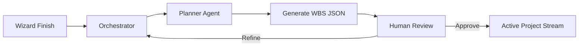
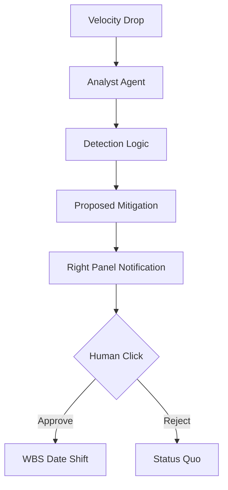

# SunAI Agency — Initial Setup Plan & Core Architectural Specification

This document serves as the high-level roadmap and design contract for the initial build of the SunAI Agency platform.

## 1) PROJECT SNAPSHOT

| Field | Value |
| :--- | :--- |
| **Project Name** | SunAI Agency Platform |
| **One-Line Description** | An AI-powered operations engine that transforms ambiguous project ideas into structured, executable agency workflows. |
| **Primary Users** | Agency Principals, Project Managers, Operations Directors. |
| **Industry** | Professional Services / AI Automation Agencies. |
| **Core Problem Solved** | Discovery Paralysis: The high cost and slow velocity of translating complex client "intent" into deterministic project tasks. |
| **Desired Outcome** | A "Quiet Execution" environment where AI handles the heavy lift of planning while humans maintain absolute control. |

## 2) PURPOSE (WHY THIS EXISTS)
The SunAI Agency Platform exists to eliminate "Discovery Paralysis" in professional services. It bridges the gap between high-level creative vision and granular task execution using specialized AI agents that architect projects with mathematical precision.

## 3) GOALS (OUTCOMES)
*   **Velocity:** Reduce project setup time from 48 hours to 15 minutes.
*   **Precision:** Achieve 95% accuracy in Work Breakdown Structure (WBS) generation.
*   **Transparency:** Provide a real-time "Pulse" of all active AI agent reasoning.
*   **Safety:** Ensure 0% data writes occur without explicit human authorization.
*   **Scalability:** Enable a single PM to manage 4x more projects than traditional models.
*   **Visual Fidelity:** Maintain a "Digital Luxury" aesthetic that justifies high-ticket services.

## 4) CORE SCOPE (V1 ONLY)

| In Scope (V1) | Out of Scope (Later) |
| :--- | :--- |
| Multi-step Project Intake Wizard | Automated Client Invoicing |
| AI WBS & Timeline Generation | Real-time Video Collaboration |
| 3-Panel Project Command Center | Third-party Tool Marketplace |
| Relationship Intelligence (CRM) | Native Mobile Applications |
| Human-in-the-loop Approval Gates | Advanced Multi-tenant Permissions |
| Basic Audit Logging | Cross-project Resource Leveling |

## 5) CORE SYSTEM COMPONENTS (V1)
*   **Auth + Protected Routes:** Secure session management ensures data isolation between project streams.
*   **Wizard Intake:** A structured 6-step journey that extracts project DNA and constraints.
*   **Main Dashboard:** A high-level operational hub for monitoring velocity and next steps.
*   **AI Assistant:** A background "Architect" that proposes roadmaps and detects risks.
*   **Data Persistence:** A centralized Postgres/Supabase store acting as the "Source of Truth."
*   **Approval Gate:** A mandatory UI layer that intercepts all AI-proposed actions.
*   **Audit Log Basics:** A timestamped record of every human "Approve" signal.

## 6) ROUTE MAP (WITH PLACEHOLDERS)

| Route | Page Name | Purpose | Status (Now) |
| :--- | :--- | :--- | :--- |
| `/` | Marketing Home | Brand storytelling and lead acquisition. | Placeholder |
| `/login` | Auth Entry | Secure access for agency staff. | Placeholder |
| `/dashboard` | CORE Dashboard | Primary ops hub for active projects. | Ready for Build |
| `/wizard` | Project Wizard | Structured intake for new client signals. | Placeholder |
| `/projects/:id` | Project Stream | The 3-panel command center for execution. | Placeholder |
| `/proposal/:id` | Digital Proposal | Editorial-style proposal for client review. | Placeholder |
| `/admin` | Admin Dashboard | Global agency settings and user management. | Placeholder |
| `/admin/main` | System Vitals | High-level financial and resource metrics. | Placeholder |
| `/pricing` | Pricing Matrix | Public-facing service tiers. | Placeholder |
| `/case-studies` | Portfolio | Showcasing previous "Architected" results. | Placeholder |
| `/contact` | Signal Intake | Direct contact form for prospects. | Placeholder |

## 7) CORE DASHBOARD PAGE DESIGN (DETAILED)

### A) Purpose
*   **Who uses it:** Agency Principals and Project Managers.
*   **What it helps them do:** Instantly identify project "Risks," approve "Proposed Actions," and track "Global Velocity" across all active streams in under 30 seconds.

### B) Layout & Sections (UI Breakdown)

| Section | What’s inside | Primary actions | States (empty/loading/error) |
| :--- | :--- | :--- | :--- |
| **Top Context Header** | Agency name, Active Project count, System status. | Switch Workspace, Global Search. | Skeleton loaders for stats. |
| **KPI / Stats Row** | Global Velocity %, Pending Approvals, Burn Rate. | Click to filter main view. | Pulse animation while syncing. |
| **Next Best Actions** | Ranked list of "AI Proposals" requiring human review. | Approve / Edit / Reject. | "All Clear" checkmark state. |
| **Active Streams** | High-fidelity cards for each project in execution. | Launch Project Command Center. | Empty: "Start First Project" CTA. |
| **Recent Activity** | Ticker of agent thoughts and human approvals. | View Audit Log. | Scrolling list of text signals. |
| **Right Panel (AI)** | Contextual logic based on the selected dashboard item. | View Reasoning / Chat with Analyst. | "Select project to see intel." |

### C) Core Features (Must Ship)
*   Global "Operational Velocity" gauge.
*   Centralized "Approval Queue" for all AI-generated drafts.
*   Quick-launch button for the "New Project Wizard."
*   Visual "Health Rings" for project status in the card grid.
*   "At-Risk" filtering for project timelines.
*   One-click navigation to Project Blueprints.
*   Live "Agent Pulse" indicator (Thinking/Idle).
*   Monochrome Logo Ticker for client context.

### D) Advanced Features (Later)
*   Cross-project resource conflict detection.
*   Automated weekly status email generation.
*   Financial ROI projections for specific projects.
*   Dark Mode "War Room" toggle.
*   Voice-activated command console.

### E) 3 Real-World Use Cases
1.  **The Morning Audit:** Principal checks "Approval Queue" to authorize 5 task drafts generated overnight by the Planner Agent.
2.  **The Crisis Manager:** PM sees a project ring turn "Signal Orange" (at risk) and clicks into it to view the AI's mitigation proposal.
3.  **The Sales Close:** Sales Lead checks the "Proposal Status" and uses the Comms Agent to draft a personalized follow-up based on the client's last interaction.

### F) One End-to-End User Journey
Visit Dashboard → Review Next Best Actions (AI suggests drafting a follow-up) → Launch Project Wizard for a new inbound lead → Complete 6-step intake flow → Wait for Planner Agent to architect the WBS → Review and Approve the generated Proposal → Return to Dashboard to see the new project stream added to "Active Ops."

## 8) WORKFLOWS (MERMAID-READY)

### 1. Wizard-to-Proposal Pipeline
*   **Trigger:** User clicks "Finalize Blueprint" in Step 6 of the Wizard.
*   **Conditions:** All identity and constraint fields must be valid.
*   **Actions:** Orchestrator calls Planner Agent (Pro) → Generates WBS → Writes Draft to DB.
*   **Stored Outputs:** Project Blueprint JSON, Draft WBS.
*   **Approval Gate:** User must click "Launch Project" to convert draft to active execution.

### 2. Task Optimization Loop
*   **Trigger:** Project velocity falls below 70%.
*   **Conditions:** Project must be in "Active" status.
*   **Actions:** Risk Analyst Agent detects bottleneck → Proposes re-allocation of tasks.
*   **Stored Outputs:** Logic reasoning log, Updated Phase roadmap.
*   **Approval Gate:** No task dates shift until the PM clicks "Authorize Re-plan."

## 9) AI ROLE (CORE ONLY)

### AI Can:
*   Propose 4-phase project structures (WBS).
*   Synthesize market news from URLs (Grounding).
*   Calculate relationship health scores (Scoring).
*   Draft sophisticated editorial-style copy (Text Gen).
*   Identify resource risks and timeline slippage (Analysis).

### AI Cannot:
*   Commit changes to the database directly.
*   Send emails to clients without a human review.
*   Adjust project budgets or deadlines autonomously.
*   Delete user accounts or global agency configurations.

**The Golden Rule:** AI can propose actions, but cannot write changes without explicit human approval.

## 10) VITE + REACT BEST PRACTICES

*   **Routing:** Use `HashRouter` for maximum stability on static hosts and preview reloads.
*   **Folders:** Standardize `src/pages`, `src/components`, `src/services`, and `src/layouts`.
*   **Env Safety:** All API keys must live in `process.env` and never be hardcoded in the client bundle.
*   **Standard UI:** Implement Skeleton loaders for every data-fetching component.
*   **Wrappers:** Use `MainLayout` and `MarketingLayout` to enforce the 3-panel law globally.
*   **Patterns:** Build reusable Card, Table, and ApprovalGate components for consistency.
*   **A11y:** Ensure high-contrast ratios (#0A1628 vs #FFFFFF) and full keyboard navigation for the Wizard.
*   **Perf:** Use `React.memo` for the Orbital System and heavy chart components to prevent re-render lag.

## 11) SUCCESS CRITERIA (V1)
*   App boots and renders Dashboard in < 1.2 seconds.
*   New Project Wizard completes all 6 steps without state loss.
*   Gemini 3 Pro generates a valid JSON WBS in < 10 seconds.
*   3-Panel Law is maintained across CRM, Projects, and Wizards.
*   All AI actions require exactly one "Approve" click to execute.
*   Project data persists correctly in localStorage (v1) or Supabase (v1.5).
*   Responsive design allows PMs to check status on Tablet devices.

## 12) NEXT STEPS
1.  Wireframe the 3-panel Dashboard and 6-step Wizard interactions.
2.  Define the minimal Project and Task data models.
3.  Implement the `orchestrationService.ts` for routing agent inputs.
4.  Add placeholder routes for all 21 planned marketing pages.
5.  Initiate the First Build cycle starting with `MainLayout.tsx`.