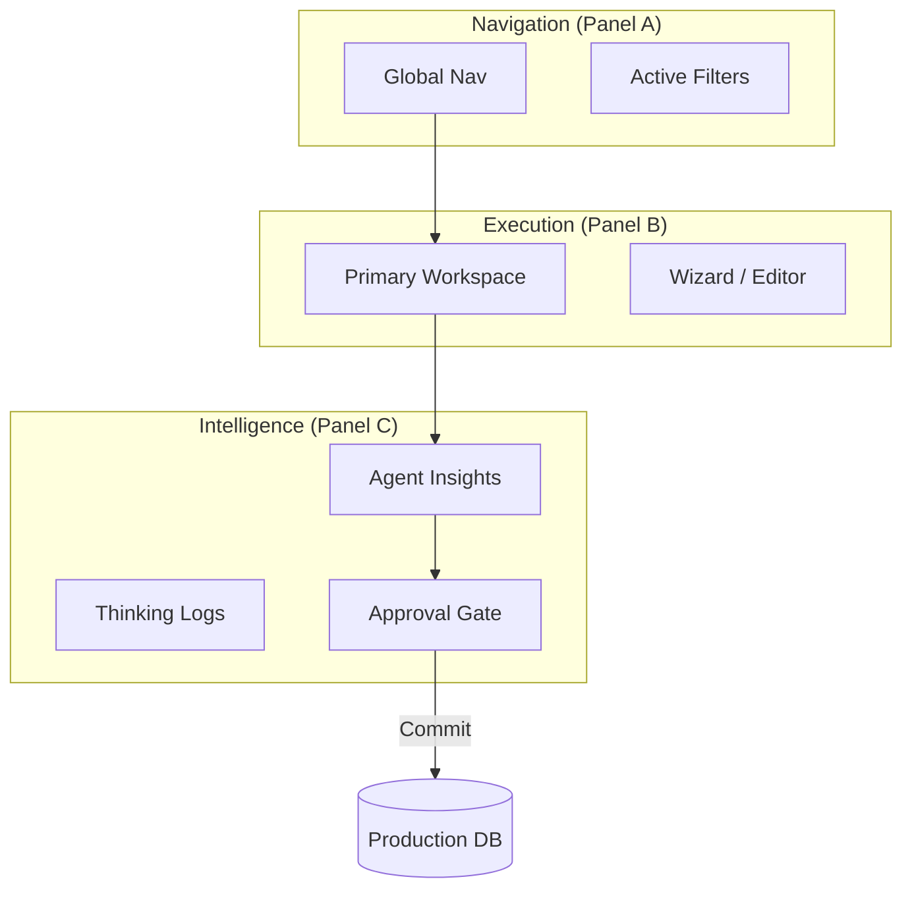

# Sun AI Agency — System Architecture & Agent Matrix

**Version:** 2.2 (Gemini 3 Production Standard)
**Status:** REFERENCE ARCHITECTURE

---

## 🤖 Gemini 3 Feature & Tooling Matrix

This matrix defines the specific capabilities leveraged across the platform.

| Feature / Tool | Model Support | Configuration | Core Purpose |
| :--- | :--- | :--- | :--- |
| **Thinking** | `gemini-3-pro-preview` | `thinkingBudget: 4k-32k` | Strategic reasoning, WBS generation, and risk analysis. |
| **Code Execution** | `gemini-3-pro-preview` | `tools: [{codeExecution: {}}]` | Mathematical audits, budget burn calculations, SPI/CPI. |
| **Search Grounding** | `gemini-3-pro/flash` | `tools: [{googleSearch: {}}]` | Real-time market data, news enrichment, competitor scans. |
| **Maps Grounding** | `gemini-3-pro/flash` | `tools: [{googleMaps: {}}]` | Visual context for company headquarters and logistics. |
| **Structured Outputs** | All G3 Models | `responseMimeType: 'json'` | Enforcing rigid schemas for WBS, reports, and UI state. |
| **Function Calling** | All G3 Models | `tools: [{functionDeclarations}]` | Triggering system actions (e.g., "Create Project", "Send Email"). |
| **Interactions API** | Native G3 | N/A | Low-latency voice/video sync for future agent comms. |
| **Image Gen (Nano)** | `gemini-3-pro-image` | `aspectRatio: "16:9"` | Generating visual moodboards and layout wireframes. |
| **Deep Research** | `gemini-3-pro-preview` | System-driven tool | Exhaustive web-crawling for intelligence reports. |

---

## 👥 Agent Type Registry

| Agent Name | Primary Model | Responsibility | Interaction Pattern |
| :--- | :--- | :--- | :--- |
| **Orchestrator** | `gemini-3-flash-preview` | Decides which specialized agent runs + in what order. | Router (Flash) |
| **Planner** | `gemini-3-pro-preview` | Turns high-level goals into phases, tasks, and dependencies. | Thinking (Pro) |
| **Analyst** | `gemini-3-pro-preview` | Finds patterns, risks, insights, and health scores. | Code Exec (Pro) |
| **Ops Automation** | `gemini-3-flash-preview` | Watches triggers, sends alerts, and schedules actions. | Logic (Flash) |
| **Content/Comms** | `gemini-3-flash-preview` | Writes sophisticated emails, briefs, and editorial reports. | Text (Flash) |
| **Retriever (RAG)** | `gemini-3-pro-preview` | Searches agency SOPs, docs, and contracts via pgvector. | RAG (Pro) |
| **Extractor** | `gemini-3-flash-preview` | Pulls structured fields from raw PDFs and client briefs. | Extraction (Flash) |
| **Optimizer** | `gemini-3-pro-preview` | Refines timelines, budgets, and resource allocation. | Reasoning (Pro) |
| **Scorer** | `gemini-3-flash-preview` | Computes relationship health and ROI scores. | Scoring (Flash) |
| **Controller** | **Human UI Gate** | Ensures AI only "proposes"—never "commits" without approval. | Manual (Human) |

---

## 🏗 System Hierarchy & Layout Logic

The platform strictly adheres to the **Context · Work · Intelligence** flow (3-Panel Law).

---

## 📜 Global UI/UX Guardrails
1. **Selection Context:** Clicking any entity in Panel B **MUST** switch the Right Panel (Panel C) to that entity's specific intelligence tab.
2. **Quiet AI:** No auto-popups. Intelligence waits for user interaction or selection.
3. **No Black Box:** Always show a "Thinking..." or "Grounding..." status when agents are active.
4. **Draft Consistency:** Any AI-written content must use the "Editorial Luxury" brand voice (Sophisticated, Minimal, Precise).
