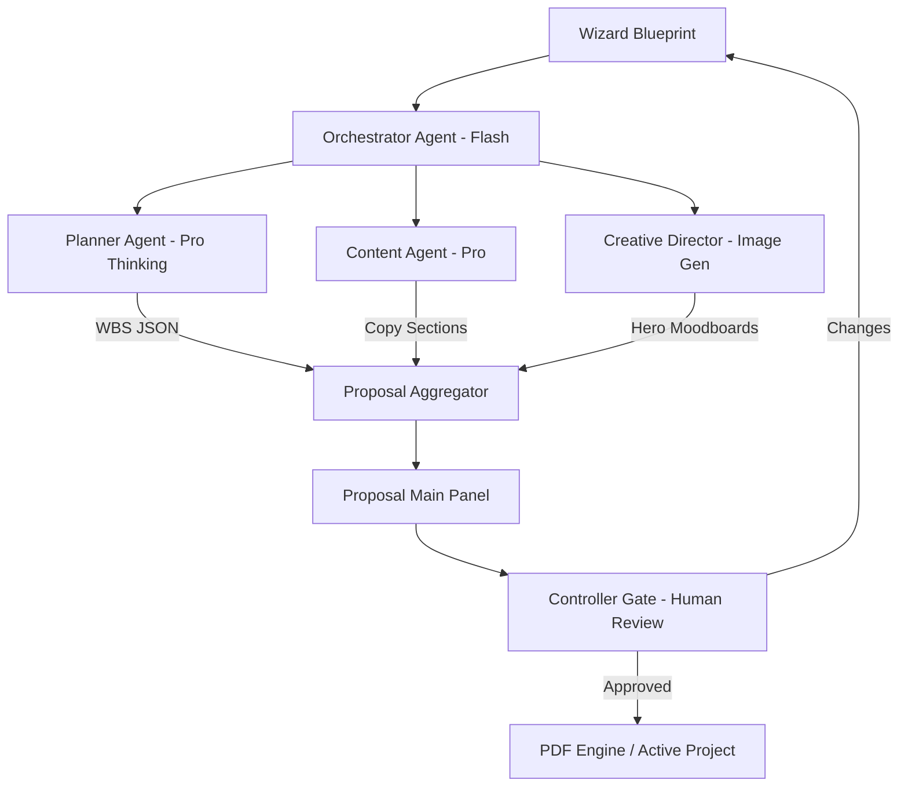

# Task 01: Proposal Generation System (P0)

**Feature:** Automated Editorial Proposal Generation  
**Priority:** P0  
**Dependencies:** Project Wizard complete  
**Status:** In Progress  
**Estimated Effort:** 2 weeks

---

## Purpose & Goals

**Purpose:** Transform ambiguous "Wizard Blueprints" into high-fidelity, client-ready digital proposals that justify agency services through logic and visual aesthetics.

**Goals:**
- Generate professional 15-page proposals in under 15 seconds.
- Reduce manual proposal creation time from 48 hours to 30 minutes (96% reduction).
- Use "Thinking" models to provide logical depth for high-ticket agency pricing.
- Support multi-version handling and client feedback loops.

**Why It's Important:** The proposal is the primary conversion gate. By automating the transition from intake to offer, the agency can strike while the lead is hot, providing a depth of reasoning that manual teams cannot match in the same timeframe.

---

## 🏗 System Architecture

---

## 📐 3-Panel Layout Specification

| Panel | Content | Behavior |
| :--- | :--- | :--- |
| **A (Left)** | **TOC Navigator** | Sticky links to Overview, Strategy, Roadmap, Cost, and Approval. |
| **B (Main)** | **Editorial Surface** | Vertical scroll, white space, `Playfair Display` headlines. |
| **C (Right)** | **The Editor's Desk** | **Tabs:** [Logic] (Planner Reasoning) | [Visuals] (Moodboards) | [History] (Versions). |

---

## 🤖 AI Logic & Agents

| Agent | Gemini Model | Tool | Responsibility |
| :--- | :--- | :--- | :--- |
| **Orchestrator** | `gemini-3-flash-preview` | `functionCalling` | Coordinates pipeline, manages state, and handles versioning. |
| **Planner** | `gemini-3-pro-preview` | `thinkingBudget: 16k` | Architects the 4-8 week roadmap phases and architecture. |
| **Content** | `gemini-3-pro-preview` | `structuredOutputs` | Generates "Luxury Minimalist" copy for all proposal sections. |
| **Creative Dir** | `gemini-2.5-flash-image` | `imageConfig` | Generates 16:9 brand-aligned project moodboards. |

---

## 🛠 Multi-Step Build Prompts

### Step 1: The Editorial Document Surface
Build `ProposalFullView.tsx` at `/app/proposals/:id`. Enforce the 3-Panel Law. Panel B (Main) must follow the "Editorial Luxury" system: 800px max-width, serif headlines. Sections: Hero (AI-Generated), Executive Summary, Strategy, Phased Roadmap (Kanban cards), Investment Grid, and Terms.

### Step 2: Orchestration Pipeline
Create `proposalService.ts`. Implement an orchestrator using `gemini-3-flash-preview`. It must take the `WizardBlueprint` and trigger parallel calls to `Planner` (Pro) for WBS and `Content` (Pro) for text. Return a unified `ProposalState` object.

### Step 3: Change Management & Versioning
Implement the "Request Changes" workflow. When a user requests a change in the Right Panel, the Orchestrator must take the previous proposal version and the feedback to generate Version 2. Add a `VersionComparison.tsx` view.

---

## ✅ Success Criteria
- [ ] Proposal loads in < 15 seconds.
- [ ] 3-Panel Law is strictly maintained.
- [ ] PDF download is functional and matches editorial styling.
- [ ] Versioning tracks all changes between v1 and v2.
