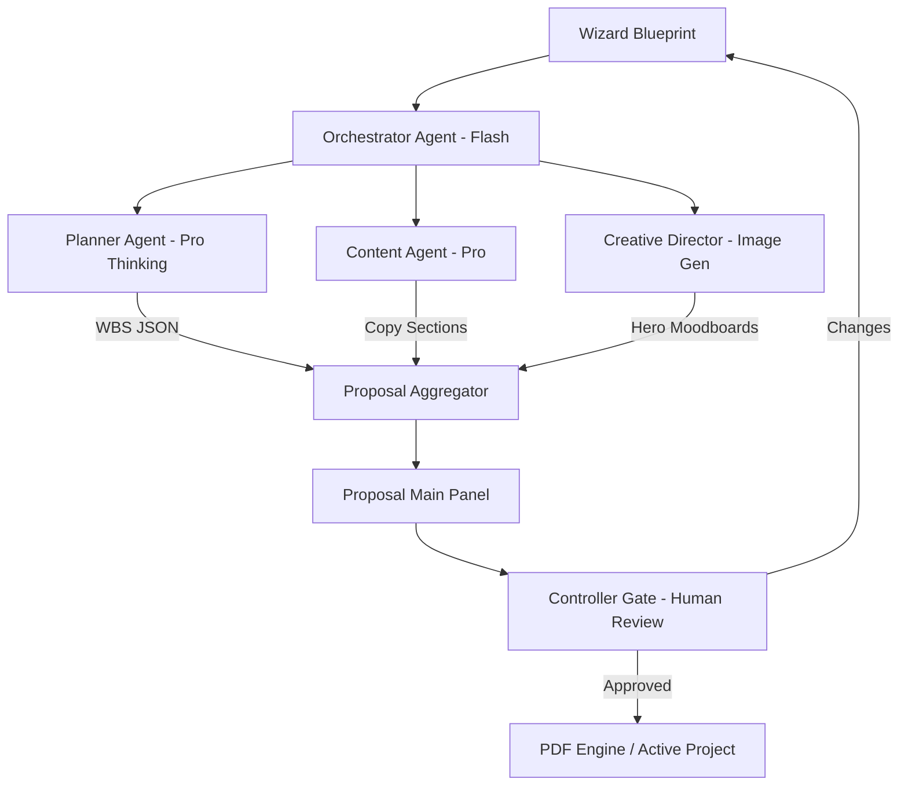

# Task 01: Proposal Generation System (P0)

**Feature:** Automated Editorial Proposal Generation  
**Priority:** P0  
**Dependencies:** Project Wizard complete  
**Status:** In Progress  
**Estimated Effort:** 2 weeks

---

## 🟢 What's Already Complete
- [x] **UI Surface:** `pages/ProposalFullView.tsx` implemented with 3-panel layout.
- [x] **Visuals Agent:** `services/creativeService.ts` integrated with `gemini-3-pro-image-preview`.
- [x] **Navigation:** Table of Contents and sticky headers functional.
- [x] **Service Layer:** Basic Supabase service for project and moodboard updates.

---

## Purpose & Goals

**Purpose:** Transform ambiguous "Wizard Blueprints" into high-fidelity, client-ready digital proposals that justify agency services through logic and visual aesthetics.

**Goals:**
- Generate professional 15-page proposals in under 15 seconds.
- Reduce manual proposal creation time from 48 hours to 30 minutes (96% reduction).
- Use "Thinking" models to provide logical depth for high-ticket agency pricing.
- Support multi-version handling and client feedback loops.

---

## 🏗 System Architecture

---

## 📐 3-Panel Layout Specification

| Panel | Content | Behavior |
| :--- | :--- | :--- |
| **A (Left)** | **TOC Navigator** | Sticky links to Overview, Strategy, Roadmap, Cost, and Approval. |
| **B (Main)** | **Editorial Surface** | Vertical scroll, white space, `Playfair Display` headlines. |
| **C (Right)** | **The Editor's Desk** | **Tabs:** [Logic] (Planner Reasoning) | [Visuals] (Moodboards) | [History] (Versions). |

---

## 🤖 AI Logic & Agents

| Agent | Gemini Model | Tool | Responsibility |
| :--- | :--- | :--- | :--- |
| **Orchestrator** | `gemini-3-flash-preview` | `functionCalling` | Coordinates pipeline, manages state, and handles versioning. |
| **Planner** | `gemini-3-pro-preview` | `thinkingBudget: 16k` | Architects the 4-8 week roadmap phases and architecture. |
| **Content** | `gemini-3-pro-preview` | `structuredOutputs` | Generates "Luxury Minimalist" copy for all proposal sections. |
| **Creative Dir** | `gemini-3-pro-image-preview` | `imageConfig` | Generates 16:9 brand-aligned project moodboards. |

---

## ✅ Success Criteria
- [ ] Proposal loads in < 15 seconds.
- [ ] 3-Panel Law is strictly maintained.
- [ ] PDF download is functional and matches editorial styling.
- [ ] Versioning tracks all changes between v1 and v2.