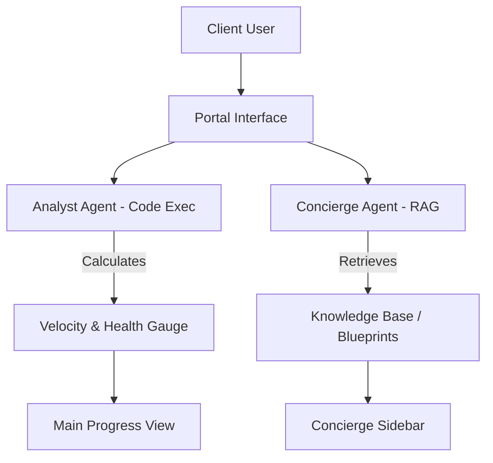

# Task 02: Client "Self-Service" Portal (P0)

**Feature:** Transparent Client Portal & Concierge  
**Priority:** P0  
**Dependencies:** Proposal Acceptance  
**Status:** Not Started  
**Estimated Effort:** 1 week

---

## Purpose & Goals

**Purpose:** Provide clients with real-time visibility into project velocity and deliverable health without manual reporting overhead.

**Goals:**
- Reduce support-related overhead by 80%.
- Translate technical progress into business-focused "Success Signals."
- Enable secure access to all project documents (Proposals, Deliverables).
- Provide a RAG-enabled "Concierge" for instant project Q&A.

**Why It's Important:** Transparency builds trust. By giving clients a "Window into the Factory," the agency reduces anxiety and eliminates the "Status Update" meeting cycle, allowing the team to focus on execution.

---

## 🏗 System Architecture

---

## 📐 3-Panel Layout Specification

| Panel | Content | Behavior |
| :--- | :--- | :--- |
| **A (Left)** | **Project Streams** | Toggle between Active and Archived projects. |
| **B (Main)** | **Delivery Stream** | Vertical timeline of "Completed Milestones" and "Active Phase." |
| **C (Right)** | **The Concierge** | **Tabs:** [Status] (Analyst Insights) | [Q&A] (RAG Chat) | [Docs] (Downloads). |

---

## 🤖 AI Logic & Agents

| Agent | Gemini Model | Tool | Responsibility |
| :--- | :--- | :--- | :--- |
| **Analyst** | `gemini-3-pro-preview` | `codeExecution` | Calculates project "Momentum Score" and health variance. |
| **Concierge** | `gemini-3-flash-preview` | `googleSearch`, `pgvector` | Answers questions using the specific project blueprint + SOPs. |
| **Content** | `gemini-3-flash-preview` | `textGeneration` | Converts technical task logs into "Client-Friendly" language. |

---

## 🛠 Multi-Step Build Prompts

### Step 1: The Client Stream Surface
Build `ClientPortalView.tsx` at `/app/portal/:id`. Design: "Minimalist Editorial". Panel B should show a "Milestone Track" with large percentage counters. Each card shows [Status] [Completion Date] [Deliverable Link].

### Step 2: The RAG Concierge (Panel C)
Integrate the `Concierge` agent into the Right Panel. Use the RAG search service to fetch project-specific context (Blueprint JSON, Task descriptions). Implement a chat interface where the agent answers with "Source: Project Blueprint" citations.

### Step 3: Approval Workflows
Build the `DeliverableReview` component in Panel C. When a client clicks "Approve," trigger a `functionCall` to update the task status in the database and notify the team.

---

## ✅ Success Criteria
- [ ] Client can only see their assigned project (RLS enforcement).
- [ ] No technical "Development" jargon is visible in the main feed.
- [ ] Concierge correctly retrieves answers from the Project Blueprint.
- [ ] Document downloads (PDFs) are functional.
