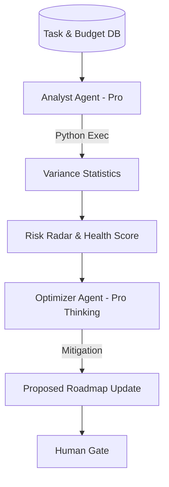

# Task 03: Project Intelligence & Risk Detection (P1)

**Feature:** Project Intelligence & Risk Detection  
**Priority:** P1  
**Dependencies:** Execution plan, project data  
**Status:** Not Started  
**Estimated Effort:** 1.5 weeks

---

## Purpose & Goals

**Purpose:** Provide AI-powered insights, risk detection, and optimization recommendations to proactively manage project health and prevent issues.

**Goals:**
- Calculate project health scores (0-100) based on multiple metrics.
- Detect risks early (timeline, budget, scope, resources, quality).
- Identify bottlenecks and optimization opportunities.
- Generate predictions for delivery dates and budgets.

**Why It's Important:** Enables proactive project management instead of reactive firefighting. By detecting risks early and providing actionable insights, project managers can prevent delays, budget overruns, and scope creep before they become critical issues.

---

## 🏗 System Architecture

---

## 📐 3-Panel Layout Specification

| Panel | Content | Behavior |
| :--- | :--- | :--- |
| **A (Left)** | **Phase Segments** | Filter intelligence by logical milestones. |
| **B (Main)** | **Intelligence Grid** | **Risk Radar** (Visual), **Health Score**, **Bottleneck Graph**. |
| **C (Right)** | **Diagnostic Brain** | **Tabs:** [Analysis] (Reasoning) | [Predictions] | [Mitigation]. |

---

## 🤖 AI Logic & Agents

| Agent | Gemini Model | Tool | Responsibility |
| :--- | :--- | :--- | :--- |
| **Analyst** | `gemini-3-pro-preview` | `codeExecution` | Runs Python-based SPI/CPI audits on task completion data. |
| **Optimizer** | `gemini-3-pro-preview` | `thinkingBudget: 12k` | Designs complex mitigation strategies for resource conflicts. |
| **Scorer** | `gemini-3-flash-preview` | `structuredOutputs` | Consolidates multiple signals into a unified Health Score. |

---

## 🛠 Key Features

**Health Score:**
- Overall score: 0-100 composite health score.
- Components: Task completion, timeline variance, budget burn rate.
- Display: Large score badge with color (Green: 70+, Yellow: 50-69, Red: <50).

**Risk Radar:**
- Visual: Radar chart showing risk areas.
- Dimensions: Timeline, Budget, Scope, Resources, Quality.
- Severity: Low, Medium, High per dimension.

**Bottleneck Detection:**
- Blocked tasks: Tasks waiting on other tasks.
- Resource constraints: Overloaded team members.
- Suggestions: Recommended actions to unblock.

---

## ✅ Success Criteria
- [ ] Health Score reflects real-time SPI/CPI data.
- [ ] Risk Radar updates dynamically when task status changes.
- [ ] No "Black Box" reasoning; Analyst thinking is visible in Panel C.
- [ ] Predictions are grounded in historical task velocity.
