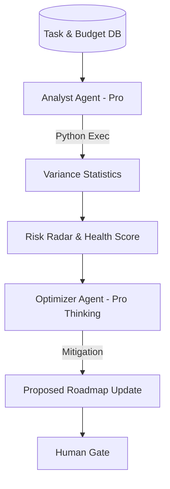

# Task 03: Project Intelligence & Risk Detection (P1)

**Feature:** Project Intelligence & Risk Detection  
**Priority:** P1  
**Dependencies:** Execution plan, project data  
**Status:** In Progress  
**Estimated Effort:** 1.5 weeks

---

## 🟢 What's Already Complete
- [x] **UI Surface:** `pages/ProjectIntelligence.tsx` implemented.
- [x] **Service Layer:** `services/intelligenceService.ts` using Gemini 3 Pro reasoning.
- [x] **Components:** `AgentCard`, `AutomationCard`, and `WorkflowCard` implemented.
- [x] **Integration:** Blueprint DNA synced from Wizard to Intelligence panel.

---

## Purpose & Goals

**Purpose:** Provide AI-powered insights, risk detection, and optimization recommendations to proactively manage project health and prevent issues.

**Goals:**
- Calculate project health scores (0-100) based on multiple metrics.
- Detect risks early (timeline, budget, scope, resources, quality).
- Identify bottlenecks and optimization opportunities.
- Generate predictions for delivery dates and budgets.

---

## 🏗 System Architecture

---

## 📐 3-Panel Layout Specification

| Panel | Content | Behavior |
| :--- | :--- | :--- |
| **A (Left)** | **Phase Segments** | Filter intelligence by logical milestones. |
| **B (Main)** | **Intelligence Grid** | **Risk Radar** (Visual), **Health Score**, **Bottleneck Graph**. |
| **C (Right)** | **Diagnostic Brain** | **Tabs:** [Analysis] (Reasoning) | [Predictions] | [Mitigation]. |

---

## 🤖 AI Logic & Agents

| Agent | Gemini Model | Tool | Responsibility |
| :--- | :--- | :--- | :--- |
| **Analyst** | `gemini-3-pro-preview` | `codeExecution` | Runs Python-based SPI/CPI audits on task completion data. |
| **Optimizer** | `gemini-3-pro-preview` | `thinkingBudget: 12k` | Designs complex mitigation strategies for resource conflicts. |
| **Scorer** | `gemini-3-flash-preview` | `structuredOutputs` | Consolidates multiple signals into a unified Health Score. |

---

## ✅ Success Criteria
- [ ] Health Score reflects real-time SPI/CPI data.
- [ ] Risk Radar updates dynamically when task status changes.
- [ ] No "Black Box" reasoning; Analyst thinking is visible in Panel C.
- [ ] Predictions are grounded in historical task velocity.