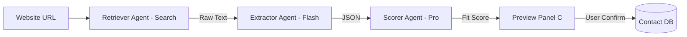

# Task 04: Contact Enrichment Pipeline (P0)

**Feature:** Automated Contact Enrichment  
**Priority:** P0  
**Dependencies:** CRM complete  
**Status:** Not Started  
**Estimated Effort:** 1.5 weeks

---

## Purpose & Goals

**Purpose:** Automatically populate contact and company data from websites and public sources, eliminating manual data entry and improving lead qualification efficiency.

**Goals:**
- Extract company information (name, industry, size, tech stack) from websites.
- Calculate lead fit scores automatically using agency-specific ICP criteria.
- Reduce manual data entry by 80%.
- Provide enriched data previews for human-in-the-loop approval.

**Why It's Important:** Saves significant time in lead qualification. Automating enrichment allows sales reps to focus on high-value activities like relationship building and closing deals, while ensuring data accuracy and completeness.

---

## 🏗 System Architecture

---

## 📐 3-Panel Layout Specification

| Panel | Content | Behavior |
| :--- | :--- | :--- |
| **A (Left)** | **Lead Segments** | "Ready for Research", "VIP Prospects", "Risks". |
| **B (Main)** | **Contacts Table** | Primary list with "Trigger Enrichment" buttons. |
| **C (Right)** | **Enrichment Hub** | **Tabs:** [Preview] (Data) | [Insights] (Scorer Reasoning) | [Sources]. |

---

## 🤖 AI Logic & Agents

| Agent | Gemini Model | Tool | Responsibility |
| :--- | :--- | :--- | :--- |
| **Retriever** | `gemini-3-pro-preview` | `googleSearch`, `URL Context` | Crawls website and news articles to find live "Signals." |
| **Extractor** | `gemini-3-flash-preview` | `structuredOutputs` | Maps raw text to the rigid `Contact` schema (Strict JSON). |
| **Scorer** | `gemini-3-pro-preview` | `codeExecution` | Calculates "Lead Quality" score using Python-based criteria. |
| **Controller** | `gemini-3-flash-preview` | `structuredOutputs` | Validates data integrity before showing the preview. |

---

## 🛠 Enrichment Flow

1. User clicks "Enrich" or automation triggers.
2. Retriever fetches website content (URL Context, 2-4s).
3. Extractor structures data (Structured Outputs, <1s).
4. Scorer calculates fit score (Code Execution, 1-3s).
5. Preview shown in Right Panel.
6. User confirms → Applied to contact.

---

## ✅ Success Criteria
- [ ] Pipeline completes in < 30 seconds.
- [ ] No data is saved to the DB without a "Human Approval" click.
- [ ] Citations are valid and clickable.
- [ ] Tech stack chips correctly identify core technologies (React, Stripe, etc).
