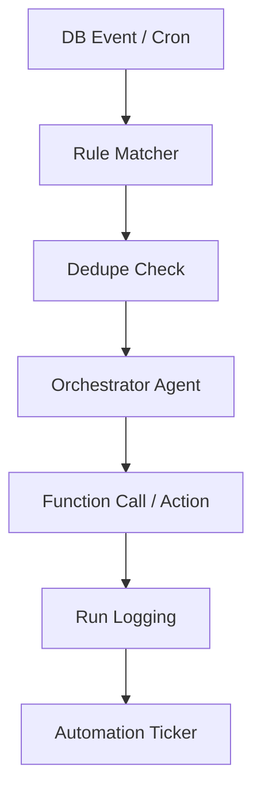

# Task 05: The Automation Center (P0)

**Feature:** Automation Engine & Center  
**Priority:** P0  
**Dependencies:** Database triggers  
**Status:** Not Started  
**Estimated Effort:** 2 weeks

---

## Purpose & Goals

**Purpose:** Enable trigger-based workflow automation to eliminate repetitive manual tasks and ensure consistent follow-up sequences.

**Goals:**
- Create and manage automation rules (triggers + actions).
- Execute automations reliably with zero duplicate runs (Dedupe Protection).
- Log all automation runs for auditing and transparency.
- Provide automation metrics and real-time activity ticker.

**Why It's Important:** Automates routine workflows like contact enrichment, follow-up sequences, and deal stage transitions. This ensures nothing falls through the cracks and reduces manual work by 5+ hours per week per user.

---

## 🏗 System Architecture

---

## 📐 3-Panel Layout Specification

| Panel | Content | Behavior |
| :--- | : :--- | :--- |
| **A (Left)** | **Workflow Lib** | Categories: CRM, Projects, Finance, Comms. |
| **B (Main)** | **The Factory** | Real-time Ticker of active agent runs & Rule List. |
| **C (Right)** | **Logic Detail** | **Tabs:** [Reasoning] (Logs) | [Metrics] | [Safety]. |

---

## 🤖 AI Logic & Agents

| Agent | Gemini Model | Tool | Responsibility |
| :--- | :--- | :--- | :--- |
| **Orchestrator** | `gemini-3-flash-preview` | `functionCalling` | Executes automation actions (Send email, update status). |
| **Ops Monitor** | `gemini-3-pro-preview` | `codeExecution` | Scans system for anomalies (Budget drift) and triggers alerts. |
| **Controller** | `gemini-3-flash-preview` | `structuredOutputs` | Validates gated actions (Human-in-the-loop). |

---

## 🛠 Dedupe Protection
- **Critical:** Every automation run needs a unique `dedupe_key`.
- **Format:** `{trigger_type}:{entity_type}:{entity_id}:{version}`
- **Constraint:** Unique constraint in `automation_runs` table prevents duplicate executions.

---

## ✅ Success Criteria
- [ ] Automations trigger correctly on DB events.
- [ ] Dedupe system prevents 100% of duplicate runs.
- [ ] Thinking logs are visible in real-time.
- [ ] Batch approval in Panel C commits actions correctly.
