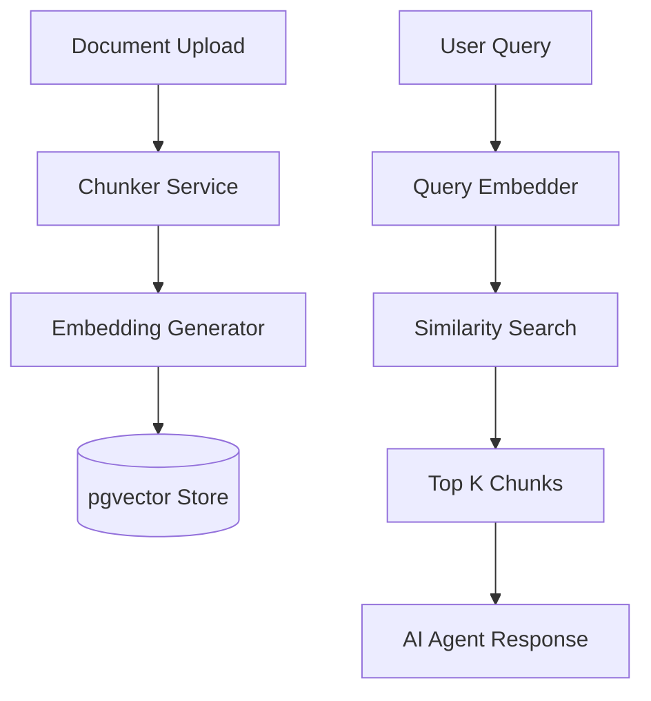

# Task 06: RAG Knowledge Base System (P0)

**Feature:** RAG System with pgvector  
**Priority:** P0  
**Dependencies:** Database setup, pgvector extension  
**Status:** Not Started  
**Estimated Effort:** 1.5 weeks

---

## Purpose & Goals

**Purpose:** Create a searchable knowledge base using RAG (Retrieval Augmented Generation) to enable AI agents to access company documents, SOPs, and contracts for informed responses.

**Goals:**
- Store and chunk documents for semantic search with >85% accuracy.
- Generate embeddings (1536-dim) using Gemini `text-embedding-004`.
- Support real-time knowledge retrieval for the Concierge and Planner agents.
- Maintain strict RLS policies to isolate company data.

**Why It's Important:** Powers the chatbot and enables AI agents to answer questions based on company-specific knowledge rather than generic training data.

---

## 🏗 System Architecture

---

## 🛠 Technical Specification

| Component | Detail |
| :--- | :--- |
| **Embedding Model** | `text-embedding-004` |
| **Dimension** | 1536 (Fixed) |
| **Vector Engine** | `pgvector` (PostgreSQL) |
| **Chunk Strategy** | 500 tokens / 50 token overlap |
| **Search Method** | Cosine Similarity (threshold 0.7) |

---

## 🛠 Document Processing Pipeline

**Chunking Logic:**
- Split by tokens: 500 tokens per chunk.
- Overlap: 50 tokens overlap for context retention.
- Preservation: Preserve document structure (headings, lists).

**Embedding Generation:**
- Model: `text-embedding-004` (1536-dim).
- Constant: `EMBEDDING_DIMENSION = 1536` in `src/config/embeddings.ts`.

---

## ✅ Success Criteria
- [ ] Documents successfully chunked and embedded.
- [ ] Search returns relevant results in < 3 seconds.
- [ ] RLS policies correctly isolate company data.
- [ ] Similarity threshold prevents irrelevant hallucinations.
