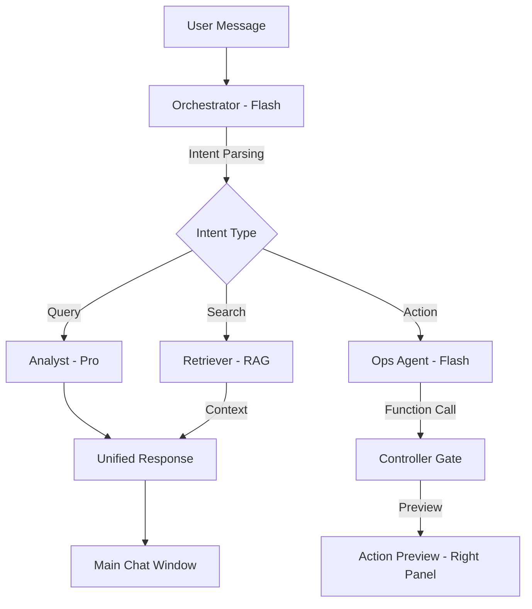

# Task 07: AI Chatbot System (P0)

**Feature:** Natural Language Chatbot Interface  
**Priority:** P0  
**Dependencies:** RAG System, Function Calling  
**Status:** Not Started  
**Estimated Effort:** 2 weeks

---

## Purpose & Goals

**Purpose:** Provide a natural language command center for users to query information, execute tasks, and get assistance without navigating multiple screens.

**Goals:**
- Parse user intent with >90% accuracy using Gemini 3 Flash.
- Execute actions via Function Calling (create tasks, draft emails).
- Search knowledge base using RAG.
- Maintain response time < 2 seconds for primary interactions.

**Why It's Important:** Transition from "UI Navigation" to "Intent-Driven Execution." Users can ask "What's the status of Project X?" instead of navigating through menus.

---

## 🏗 System Architecture

---

## 📐 3-Panel Layout Specification

| Panel | Content | Behavior |
| :--- | :--- | :--- |
| **A (Left)** | **Thread History** | Grouped by "Today", "Yesterday", "Last 7 Days". |
| **B (Main)** | **Chat Interface** | Editorial-style bubbles, multi-line input, typing indicators. |
| **C (Right)** | **Action Hub** | **Tabs:** [Preview] (Gated Actions) | [Intel] (Analyst reasoning). |

---

## 🤖 AI Logic & Agents

| Agent | Gemini Model | Tool | Responsibility |
| :--- | :--- | : :--- | :--- |
| **Orchestrator** | `gemini-3-flash-preview` | `functionCalling` | Parses user intent, routes messages to specific sub-agents. |
| **Ops Agent** | `gemini-3-flash-preview` | `functionCalling` | Performs data mutations (update task, create lead). |
| **Retriever** | `gemini-3-pro-preview` | `pgvector` | Searches knowledge base for grounding context. |
| **Analyst** | `gemini-3-pro-preview` | `codeExecution` | Answers complex data queries with mathematical precision. |

---

## ✅ Success Criteria
- [ ] Intent parsing handles ambiguous queries accurately.
- [ ] Action previews in Panel C are interactive (Confirm/Edit/Cancel).
- [ ] Chat history is persistent and responsive.
- [ ] Response latency (time to first token) is < 800ms for Flash.
