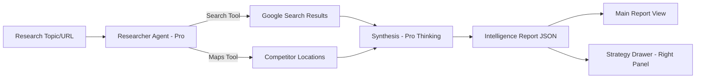

# Task 08: Deep Research Module (P1)

**Feature:** Deep Research with Google Search Grounding  
**Priority:** P1  
**Dependencies:** Grounding tools (Google Search, Maps)  
**Status:** Not Started  
**Estimated Effort:** 1 week

---

## Purpose & Goals

**Purpose:** Generate comprehensive market research reports using Google Search and Maps grounding to provide real-time competitive intelligence.

**Goals:**
- Research companies and industries with real-time web data.
- Generate 5-page editorial "Market Intelligence Reports" in < 60 seconds.
- Ground all claims in live Google Search and Google Maps data.
- Provide clickable citations for 100% of generated news signals.

**Why It's Important:** Provides a competitive advantage by automating deep-web intelligence gathering. Teams start every conversation with recent, relevant information rather than outdated data.

---

## 🏗 System Architecture

---

## 📐 3-Panel Layout Specification

| Panel | Content | Behavior |
| :--- | :--- | :--- |
| **A (Left)** | **Research Queues** | Lists "Active Scans", "Recent Reports", and "Industry Watches". |
| **B (Main)** | **Report Surface** | Editorial document with charts, map embeds, and news feeds. |
| **C (Right)** | **Strategy Drawer** | **Tabs:** [Roadmap] (Proposed plan) | [Audit] (Data confidence) | [Sources]. |

---

## 🤖 AI Logic & Agents

| Agent | Gemini Model | Tool | Responsibility |
| :--- | :--- | :--- | :--- |
| **Researcher** | `gemini-3-pro-preview` | `googleSearch`, `googleMaps` | Performs exhaustive data fetch and competitor mapping. |
| **Planner** | `gemini-3-pro-preview` | `thinkingBudget: 8k` | Converts research findings into an executable 4-week roadmap. |
| **Auditor** | `gemini-3-flash-preview` | `structuredOutputs` | Validates source reliability and identifies data gaps. |

---

## ✅ Success Criteria
- [ ] Research reports contain at least 10 unique news signals with citations.
- [ ] Maps grounding correctly identifies business competitors.
- [ ] Report generation handles large grounding payloads efficiently.
- [ ] Citations link directly to the source articles.
