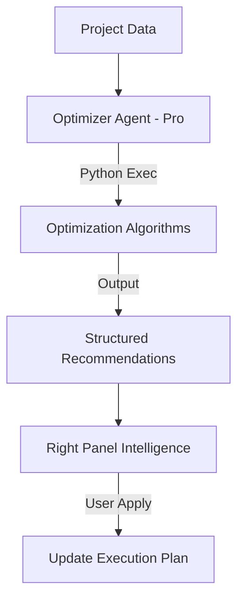

# Task 09: Optimizer Agent Implementation (P1)

**Feature:** Optimizer Agent for Efficiency  
**Priority:** P1  
**Dependencies:** Execution tracking, project data  
**Status:** Not Started  
**Estimated Effort:** 1 week

---

## Purpose & Goals

**Purpose:** Automatically analyze projects and suggest optimizations to improve timelines, budgets, and resource allocation.

**Goals:**
- Identify timeline reduction opportunities (re-balance phases, parallel execution).
- Suggest budget optimizations (resource allocation, cost reduction).
- Recommend resource allocation improvements based on skill matching.
- Provide actionable recommendations with "Apply" functionality.

**Why It's Important:** Helps project managers improve efficiency without manual analysis. Suggesting optimizations like "Re-balance phases to reduce timeline by 2 weeks" allows teams to deliver faster and more cost-effectively.

---

## 🏗 System Architecture

---

## 🤖 AI Agent Details

| Agent | Role | Gemini Tools | Responsibility |
| :--- | :--- | :--- | :--- |
| **Optimizer** | Efficiency | `gemini-3-pro-preview`, `codeExecution` | Improves timelines, budgets, resources. |

---

## 🛠 Code Execution Requirements

**Python Scripts:**
- Timeline optimization algorithm (Critical Path Analysis).
- Budget optimization algorithm (Resource Costing).
- Resource workload balancing.

**Inputs:**
- Project timeline data, budget data, resource allocation, task dependencies.

**Outputs:**
- Optimized timeline JSON, budget forecast, resource allocation plan.

---

## ✅ Success Criteria
- [ ] Optimization suggestions are accurate and actionable.
- [ ] Timeline optimizations are reasonable and grounded in project constraints.
- [ ] Budget optimizations accurately reflect resource costs.
- [ ] "Apply" workflow correctly updates the execution plan in the DB.
