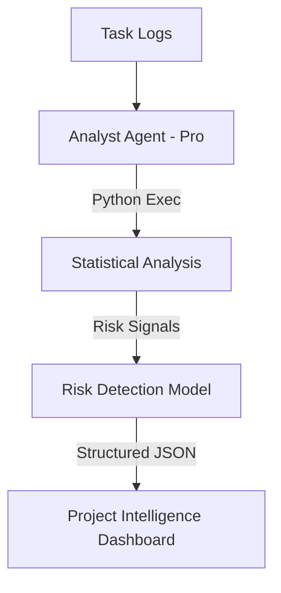

# Task 10: Analyst Agent Implementation (P1)

**Feature:** Analyst Agent for Insights & Risk Detection  
**Priority:** P1  
**Dependencies:** Project data, execution tracking  
**Status:** Not Started  
**Estimated Effort:** 1 week

---

## Purpose & Goals

**Purpose:** Automatically detect patterns, risks, and insights from project data to enable proactive management and prevent issues.

**Goals:**
- Detect risks early (timeline, budget, scope, resources, quality).
- Identify patterns in task completion, timeline variance, and resource utilization.
- Generate actionable insights and mitigation strategies.
- Calculate high-fidelity project health scores (0-100).

**Why It's Important:** Transforms reactive project management into proactive prevention. Instead of discovering problems after they occur, the Analyst agent detects issues early (e.g., "Velocity drop detected in Phase 2") and suggests fixes.

---

## 🏗 System Architecture

---

## 🤖 AI Agent Details

| Agent | Role | Gemini Tools | Responsibility |
| :--- | :--- | :--- | :--- |
| **Analyst** | Insights | `gemini-3-pro-preview`, `codeExecution` | Finds patterns, risks, insights, and health scores. |

---

## 🛠 Analysis Types

**Risk Detection:**
- Timeline risks: Overdue tasks, slow velocity.
- Budget risks: Spending exceeds allocation.
- Resource risks: Team overload, single-point-of-failure detection.

**Pattern Detection:**
- Task completion patterns (Burn-down variance).
- Resource utilization trends.
- Client engagement sentiment patterns.

---

## ✅ Success Criteria
- [ ] Risks detected correctly with accurate severity levels.
- [ ] Health scores align with actual project progress.
- [ ] Mitigation suggestions are specific and helpful.
- [ ] Analysis completes in under 5 seconds for standard projects.
