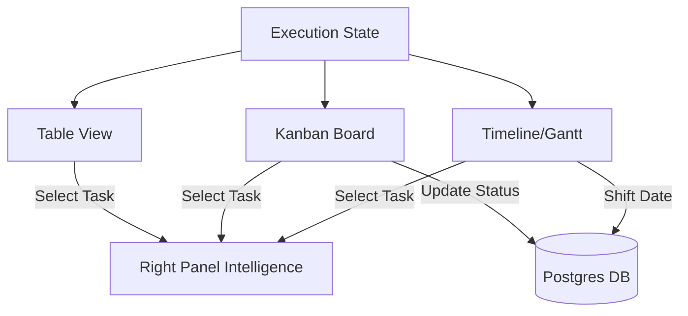

# Task 11: Visual Execution Views (Kanban & Timeline)

**Priority:** P1 (Ops UX)  
**Dependencies:** Execution Plan (Task 03)  
**Status:** Not Started  
**Estimated Effort:** 1.5 weeks  
**Role:** Interface Specialist

---

## 🎯 Purpose & Goals
The **Visual Execution Views** expand the project command center beyond simple tables. It allows managers to visualize task velocity via Kanban and long-term dependencies via a horizontal Timeline.

- **Purpose:** Provide high-fidelity visual representations of project "Momentum."
- **Goals:**
    - Implement a drag-and-drop Kanban board for task status transitions.
    - Build a horizontal "Timeline" view for phase-level dependency mapping.
    - Maintain the 3-Panel Law: Right Panel remains for Task/Phase intelligence.
    - Synchronize state instantly across all view types (Table <-> Kanban <-> Timeline).

---

## 🏗 System Architecture

---

## 📐 3-Panel Layout Specification

| Panel | Content | Behavior |
| :--- | :--- | :--- |
| **A (Left)** | **View Switcher** | Toggle between [Table] [Kanban] [Timeline]. |
| **B (Main)** | **Visual Surface** | Renders the Kanban board or Timeline Gantt. |
| **C (Right)** | **Ops Intel** | **Tabs:** [Detail] | [Risks] (Analyst reasoning). |

---

## 🤖 AI Logic Integration

| View | Agent Support | Action |
| :--- | :--- | :--- |
| **Kanban** | **Optimizer Agent** | Suggests moving a "Blocked" task to a different owner. |
| **Timeline** | **Analyst Agent** | Highlights "Critical Path" tasks that are at risk of slipping. |

---

## 🛠 Multi-Step Build Prompts

### Step 1: The View Switcher & Kanban Shell
> Build the `ViewSwitcher` component in `ProjectExecutionPlan.tsx`. Implement a Kanban board using `dnd-kit` or similar. Columns: [Todo] [In Progress] [Review] [Done]. Cards must show Task Title, Priority Badge, and Assignee Initials.

### Step 2: The Horizontal Timeline (Gantt-Lite)
> Create `ExecutionTimeline.tsx`. Implement a horizontal scrollable view where rows are "Phases" and blocks are "Tasks". Use SVG for dependency lines between tasks. Ensure dragging a task block updates its `dueDate` in the state.

### Step 3: Selection-Driven Intelligence Sync
> Ensure that clicking a Kanban Card or a Timeline Block triggers the "Ops Intel" tab in the Right Panel. The Analyst Agent should specifically provide "Critical Path Analysis" when the user is in the Timeline view.

---

## ✅ Success Criteria
- [ ] Task status updates instantly via drag-and-drop on the Kanban board.
- [ ] Timeline correctly reflects `startDate` and `dueDate` from the Task model.
- [ ] Right Panel context is perfectly synchronized across all 3 view modes.
- [ ] Layout remains responsive on Tablet/iPad Pro.
