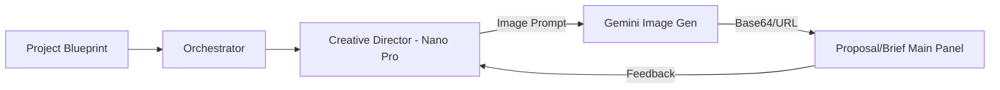

# Task 12: Creative Director Agent (Visual Intelligence)

**Priority:** P1 (Brand Fidelity)  
**Dependencies:** Proposal Generation (Task 01)  
**Status:** Not Started  
**Estimated Effort:** 1 week  
**Role:** Creative Technologist

---

## 🎯 Purpose & Goals
The **Creative Director Agent** brings "Editorial Luxury" to life. It uses Gemini's image generation capabilities to create brand-aligned visuals, moodboards, and task-specific imagery that elevate proposals and project briefs.

- **Purpose:** Eliminate "Stock Image" fatigue by generating custom, high-fidelity project visuals.
- **Goals:**
    - Generate 16:9 "Hero Moodboards" for project proposals.
    - Create "Visual Briefs" for complex creative tasks.
    - Maintain a consistent "Editorial Minimalist" style across all generated assets.
    - Provide a "Refinement Loop" where users can edit prompts for new versions.

---

## 🏗 System Architecture

---

## 🤖 AI Agent Details

| Agent | Gemini Model | Tool | Responsibility |
| :--- | :--- | :--- | :--- |
| **Creative Dir** | `gemini-3-pro-image-preview` | `imageConfig` | Generates high-fidelity 1k/2k moodboards and assets. |
| **Visual Scorer**| `gemini-3-flash-preview` | `vision` | Analyzes generated images for brand consistency. |

---

## 📐 Image Configuration Specification
- **Style:** "High-fashion editorial, minimalist, architectural, soft natural lighting."
- **Aspect Ratio:** `16:9` for Heroes, `1:1` for Task Icons.
- **Image Size:** `1K` (Default) or `2K` (Proposal Grade).

---

## 🛠 Multi-Step Build Prompts

### Step 1: Image Generation Service
> Create `creativeService.ts`. Implement a function that takes a `ProjectBlueprint` and generates a prompt for a "Strategic Hero Moodboard." Call `ai.models.generateContent` using `gemini-3-pro-image-preview`.

### Step 2: The Visual Review Gallery
> In `ProposalFullView.tsx`, implement a "Hero Section" that displays the generated image. Add an "Edit Visuals" button in the Right Panel (Panel C) that allows the user to provide a prompt adjustment (e.g., "Make it warmer, more focus on texture").

### Step 3: Task Brief Visualization
> Integrate the Creative Director into the `ExecutionRightPanel.tsx`. When a high-priority creative task is selected, show a "Visual Brief" image that helps developers/designers understand the intended aesthetic.

---

## ✅ Success Criteria
- [ ] Images are generated in < 15 seconds.
- [ ] Generated images align with the "Editorial Luxury" brand voice.
- [ ] Users can "Regenerate" images with specific feedback.
- [ ] Image assets are persisted in the Project's artifact storage.
