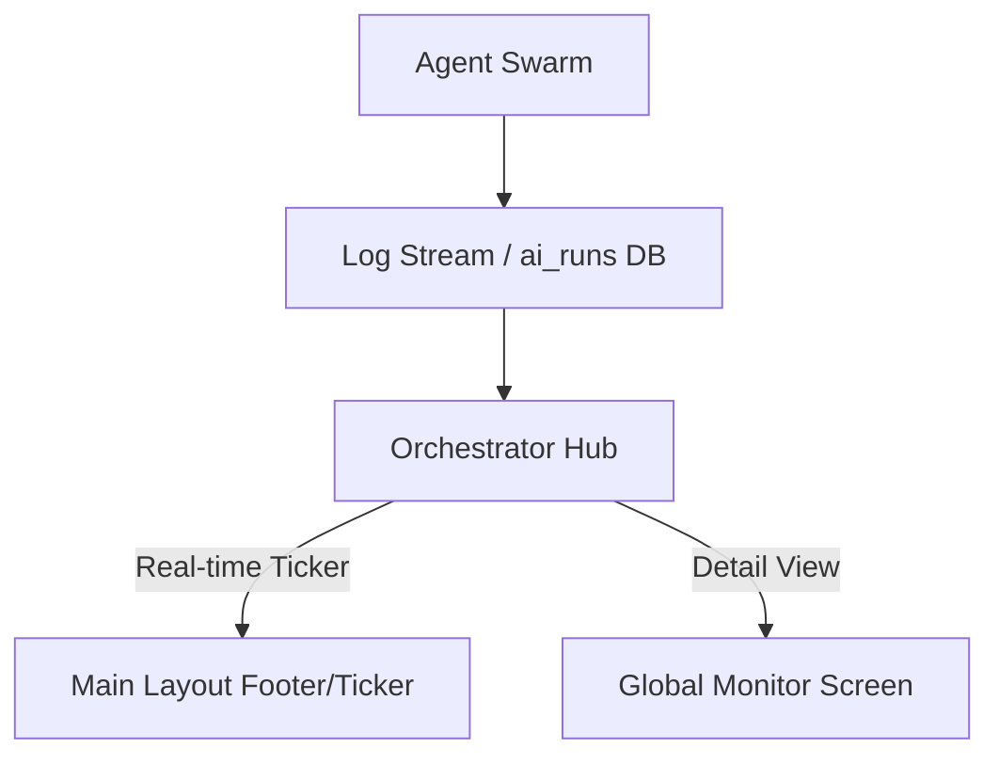

# Task 13: Global Orchestrator Monitor (Agent Ticker)

**Priority:** P1 (System Transparency)  
**Dependencies:** Automation Center (Task 05)  
**Status:** Not Started  
**Estimated Effort:** 1 week  
**Role:** Systems Architect

---

## 🎯 Purpose & Goals
The **Global Orchestrator Monitor** provides real-time visibility into the "Brain" of the agency. It tracks all active agent runs, thinking logs, and automation triggers across all projects in a single, high-fidelity ticker.

- **Purpose:** Eliminate the "Black Box" problem of AI operations.
- **Goals:**
    - Provide a real-time "Pulse" of all active agents (Thinking, Grounding, Generating).
    - Surface Gemini 3 "Thinking Logs" globally for debugging and transparency.
    - Create a "Global Activity Ticker" accessible from the main navigation.
    - Allow users to "Pause" or "Intervene" in long-running agent swarms.

---

## 🏗 System Architecture

---

## 📐 3-Panel Layout Specification (Monitor Screen)

| Panel | Content | Behavior |
| :--- | :--- | :--- |
| **A (Left)** | **Agent Folders** | Filter by [Researcher] [Planner] [Analyst] [Comms]. |
| **B (Main)** | **The Ticker** | Vertical stream of active agent cards with pulsing status rings. |
| **C (Right)** | **Internal Logic** | **Tabs:** [Reasoning] (Full Thinking Log) | [Audit] | [System Control]. |

---

## 🤖 AI Logic & Monitoring

| Component | Responsibility | Visual Signal |
| :--- | :--- | :--- |
| **Active Thinking** | Gemini 3 model is processing a prompt. | Blue pulsing ring + "Thinking..." text. |
| **Grounding** | Researcher agent is scanning the web/maps. | Emerald pulsing ring + "Grounding..." text. |
| **Human Wait** | Controller Agent is waiting for a user click. | Amber solid ring + "Awaiting Approval". |

---

## 🛠 Multi-Step Build Prompts

### Step 1: The Global Ticker Component
> Build a `GlobalAgentTicker` component to be placed in the `MainLayout.tsx` footer. It should show a horizontal scrolling list of active agent icons and their current status (e.g., "Planner: Structuring WBS...").

### Step 2: Orchestrator Dashboard View
> Create `OrchestratorDashboard.tsx` at `/app/orchestra`. Implement the 3-panel monitor layout. The Main Panel should use a "Terminal-style" UI to display incoming logs from the `ai_runs` table.

### Step 3: Stop & Resume Controls
> In the Right Panel of the Monitor, implement "Global Kill Switch" and "Pause" buttons for specific agent runs. Ensure that pausing an agent run prevents any further state changes until resumed by a human.

---

## ✅ Success Criteria
- [ ] Ticker updates in real-time as agents trigger across the platform.
- [ ] Users can view the full "Thinking Log" for any active agent run.
- [ ] System accurately identifies "Stuck" agents (runs exceeding 60s).
- [ ] Human intervention (Approvals) is clearly highlighted in the feed.
