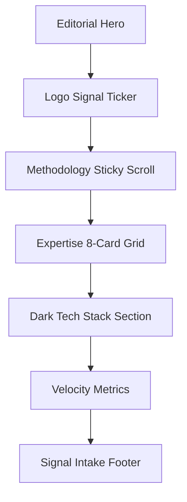

# Page 01: Home (`/`)

**Theme:** The Orbital Hub of Intelligence

## 📊 Page Structure

## 🛠 Multi-step Design Prompts

### Step 1: The Editorial Hero
> Create a min-h-screen Hero. **Left:** Playfair Headline "Build *Intelligent* AI Products" with word-by-word stagger. **Right:** `OrbitalSystem` component—a central glowing SunAI icon with 4 rotating SVG paths carrying icons for UI, LLM, CRM, and OPS. Background uses a subtle "Blueprint" SVG grid.

### Step 2: Methodology Sticky Scroll
> Design a section where the **Left Panel** stays fixed with a Playfair H2 "The Smarter Way to Build." As the user scrolls, the **Right Panel** cycles through 3 high-fidelity `BrowserFrame` mockups: (1) The Wizard, (2) The Blueprint, (3) The Execution Plan. Use animated connector lines to bridge the scroll steps.

### Step 3: Capability Grid (Illustrated)
> Build an 8-card grid. Each card is `Snow Slate` with a 40px radius. **Visuals:** Instead of icons, use "Abstract Architectural Illustrations" (SVG). On hover, the card lifts -8px and reveals a small `Thinking Terminal` at the bottom showing: `[STATUS] Analyzing Efficiency... 92%`.

### Step 4: Velocity Metrics & Chart
> Create a 2-column section. **Left:** 3 StatCards with large Serif numbers (6x, 35%, 340%). **Right:** An animated `VelocityChart` (Recharts) comparing "Traditional Cycle" (Slow Curve) vs "SunAI Cycle" (Vertical Spike).

## ✍️ Content Design
- **Headline:** "Engineered for High-Velocity Growth."
- **Subhead:** "Sun AI designs, architects, and launches high-fidelity AI operations for the world's most ambitious agencies."
- **CTA Label:** "Initiate Signal Acquisition" (Primary), "Watch Logic Demo" (Secondary).

## 📐 Responsive Strategy
- **Desktop:** Split 60/40 layouts.
- **Tablet:** Full-width sections, horizontal sliders for the Capability Grid.
- **Mobile:** Single column, orbital system simplifies to a pulsing central icon.

## 🎬 Luxury UX & Motion
- **Entrance:** Staggered `translate-y-12 opacity-0` for all cards.
- **Cursor:** Ghost Cursor animation simulating a project setup in the Methodology section.