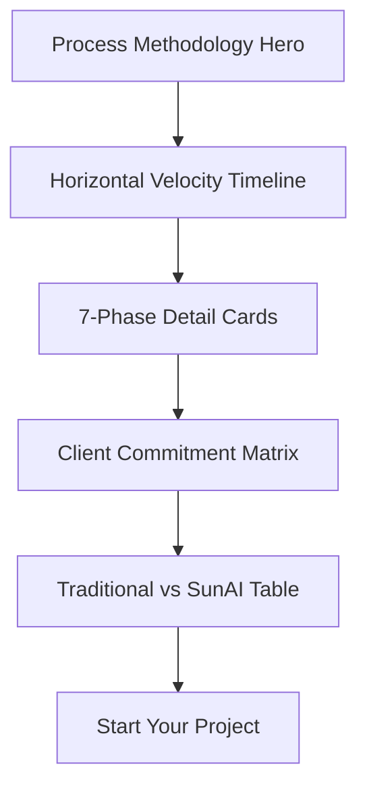

# Page 04: Process (`/process`)

**Theme:** The Architecture of Velocity

## 📊 Page Structure

## 🛠 Multi-step Design Prompts

### Step 1: The Velocity Timeline
> Build a horizontal scrolling timeline (1-7). Nodes glow when active. **Visual:** A "Blueprint" background that connects the nodes. As a node is reached, the screen reveals the specific phase deliverables (WBS).

### Step 2: Involvement Matrix (Visual)
> Create a heat-map style table showing `Time Required` (X-axis) vs `Phase` (Y-axis). Use `Agency Emerald` for Low effort and `Signal Orange` for High effort. 

### Step 3: Comparison Table (Quiet Luxury)
> A minimalist comparison table. Rows: Timeline, Deliverables, Risk. Columns: "Traditional Agency" (Grayed out/Strikethrough) vs "Sun AI" (High Contrast/Emerald). 

## ✍️ Content Design
- **Headline:** "From Ambiguity to Execution in 8 Weeks."
- **Phase 1 Headline:** "Discovery: Extracting the Intent Signal."
- **Tone:** Methodical, surgical, authoritative.

## 📐 Responsive Strategy
- **Mobile:** Timeline converts to a vertical accordion.
- **Desktop:** Horizontal mouse-wheel scroll override for the timeline section.