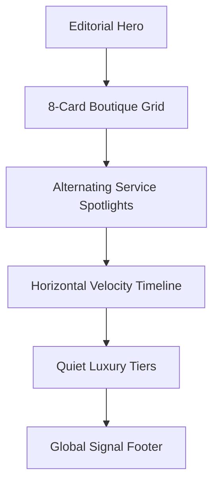

# Page 07: Services Directory (`/services`)

**Theme:** The Architecture of Value

## 📊 Page Structure

## 🛠 Multi-step Prompts

### 1. Wireframe Layout
- **Hero:** Centered H1 "Intelligence-First Services" with subtle gradient mesh background.
- **Grid:** 3-column (Desktop) grid of rounded boutique cards.
- **Spotlight:** 50/50 split sections. Left: App Mockup; Right: Deep-dive text.

### 2. Content Design
- **Hero Copy:** "Engineered for High-Velocity Growth. We turn ambiguous briefs into deterministic AI operations."
- **Service Copy:** Focus on "Zero-latency qualification" and "Model-agnostic architecture."
- **CTA:** "Book Strategy Session."

### 3. Visual Design System
- **Palette:** Deep Celestial Navy (#0A1628) for section headers.
- **Textures:** Subtle SVG "Blueprint" drawings behind expertise cards.
- **Cards:** 40px radius, 1px border-slate-100, soft shadow-xl.

### 4. Component Specifications
- `BoutiqueCard`: SVG icon (Indigo-500) + Playfair headline + 3 Sans feature pills.
- `VelocityTimeline`: Horizontal line that "draws" itself on scroll, connecting 4 nodes.
- `PricingTier`: Large serif numbers for pricing. Hidden detail "drawer" on click.

### 5. Responsive Design
- **Mobile:** Horizontal timeline converts to a vertical step list. Single column grid.
- **Tablet:** 2-column grid. Padding reduces from 120px to 48px.

### 6. User Journey & Workflows
- **Selection:** Hovering a boutique card reveals a "View Blueprint" ghost button.
- **Intake:** All footer CTAs route to Step 1 of the Project Wizard.

### 7. Luxury UX & Motion
- **Ghost Cursor:** Animate a simulated mouse cursor in the "Spotlight" sections to demo interaction.
- **Terminal Logic:** Embed a code snippet box with 0.4 opacity showing real-time agent routes.

### 8. Implementation Checklist
- [ ] Implement Route `/services`.
- [ ] Build 8 unique `BoutiqueCard` assets.
- [ ] Connect "Start Project" buttons to `/app/projects/:id/wizard`.