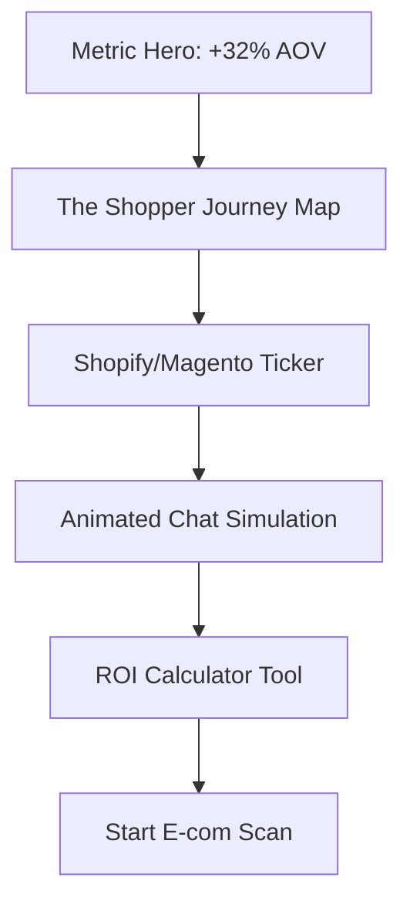

# Page 14: E-commerce AI Chatbots (`/services/chatbot/ecommerce`)

**Theme:** Conversational Revenue

## 📊 Page Structure

## 🛠 Multi-step Prompts

### 1. Wireframe Layout
- **Hero:** Massive serif number "32%" floating next to "Average Order Value Increase."
- **Journey Map:** Full-width SVG path showing a shopper moving from "Inquiry" to "Checkout."
- **Integrations:** Smooth monochrome logo ticker.

### 2. Content Design
- **Hero Copy:** "Turn Browsers into Buyers. Automatically. Our bots handle 90% of order tracking and product discovery."
- **ROI Copy:** "Calculate the impact of 24/7 autonomous shopping."
- **CTA:** "Scan Store for AI Opportunity."

### 3. Visual Design System
- **Accents:** Signal Orange (#FF6B2C) for "Checkout" and "Growth" buttons.
- **Imagery:** High-contrast, clean product mockups inside floating browser frames.

### 4. Component Specifications
- `JourneyPath`: Animated SVG path that "draws" as the user scrolls. Nodes glow when active.
- `AOVCalculator`: 3-panel interactive slider for "Monthly Visitors" vs "Current Conversion" to show projected AI lift.

### 5. Responsive Design
- **Mobile:** Journey map becomes a vertical step-indicator. Headline shrinks from 72px to 42px.

### 6. User Journey & Workflows
- **The Scan Flow:** User enters Shopify URL -> Retriever Agent "Thinking" state -> PDF report proposal preview.

### 7. Luxury UX & Motion
- **Ghost Cursor:** Animate a simulated mouse cursor hovering over "Add to Cart" while a chat bubble says "This fits your criteria perfectly."

### 8. Implementation Checklist
- [ ] Shopify/Stripe monochrome logo assets.
- [ ] Animated ROI chart logic using `recharts` or custom SVG.
- [ ] Lead capture hook to `sunai_crm_contacts`.