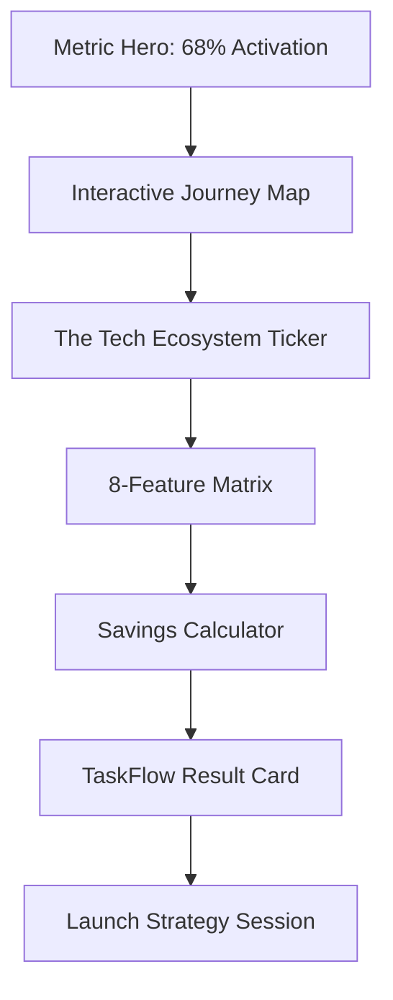

# Page 14: SaaS AI Chatbots (`/services/chatbot/saas`)

**Theme:** Instant Activation

## 📊 Page Structure

## 🛠 Multi-step Design Prompts

### Step 1: The Activation Hero
> Create a hero with a massive "68%" Serif number that pulses. Headline: "Onboard, Support, and Retain SaaS Users." Background: A blurred `Celestial Navy` mesh gradient.

### Step 2: Animated Journey Map
> Build a full-width SVG diagram. **Interaction:** As user scrolls, a "User Signal" (glowing dot) travels from `Signup` -> `AI Onboarding Agent` -> `Aha Moment`. Lines glow emerald when the dot passes.

### Step 3: ROI Savings Calculator
> Build a 3-panel calculator. **Panel 1:** Sliders for `Monthly Users` and `Support Volume`. **Panel 2 (Center):** Analyst thinking logs `[CALCULATING ROI...]`. **Panel 3:** Final "Annual Savings" result in Playfair Display with a "Blueprint" export button.

### Step 4: Feature Matrix (Luxury Grid)
> 2x4 Grid of cards. Icons are `Indigo-500` glow effect. Features: RAG, Multi-Tenant, Sentiment Analysis, SSO. Each card has a `Logic Hint` subtext (e.g., "Uses G3 Flash for <1s latency").

## ✍️ Content Design
- **Core Value:** "Zero-latency qualification for Enterprise SaaS."
- **Tone:** Technical, robust, secure. Use words like "Deterministic," "Multi-tenant," and "Latency."
- **CTA:** "Secure Your Pipeline."

## 🎬 Luxury UX & Motion
- **Journey Map:** `stroke-dashoffset` animation triggered by scroll position.
- **Calculator:** Real-time number counters with `ease-out` timing.