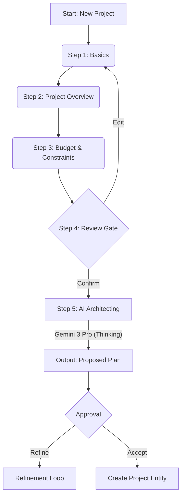

# The Wizard: Project Kickoff Master Plan

**System:** Sun AI Agency  
**Component:** New Project Wizard  
**Intelligence Model:** Gemini 3 Pro (Structured Outputs + Thinking Config)

---

## 1. System Overview & Logic

The **Wizard** is a **guided, multi-step intake and planning system** that converts **human intent** into a **structured, persistent system blueprint**.

It is **not a form** and **not a chat**. It is a structured bridge between ambiguity and execution.

### Design Principles
1.  **One decision type per screen**: Minimize cognitive load.
2.  **Progressive disclosure**: Hide complex fields until relevant.
3.  **Autosave everything**: No "Submit" button until the very end.
4.  **Right panel reflects truth**: A live-updating Blueprint Preview shows the user exactly what the system "knows."
5.  **AI is silent until Step 4**: Gather deterministic data first to prevent hallucination.
6.  **Human confirms before AI generates**: The user is the final authority on the Blueprint.
7.  **Single Mutation Source**: Every step mutates the same Blueprint object.

### Flow Diagram



---

## 2. Screen Matrix & Logic

| Screen | Purpose | Key Inputs | Right Panel (Context) | AI Agent Role |
| :--- | :--- | :--- | :--- | :--- |
| **1. Basics** | Identity & Signal | Name, Client, Website | Empty / Placeholder | **Retriever** (Background): Scans website for context. |
| **2. Overview** | Define Intent | Type (Web/Mobile), Industry, Goals | Live Blueprint Summary | **Orchestrator**: Infers implicit requirements. |
| **3. Constraints** | Feasibility | Budget, Deadline, Urgency | "Delivery Snapshot" (Calc) | **Analyst**: Calcs ROI & Feasibility. |
| **4. Review** | Human Gate | Full Summary (Editable) | Validation Checklist | **Controller**: locks inputs. |
| **5. Architecting** | Execution | None (Processing State) | Activity Stream (Logs) | **The Planner**: Generates WBS. **The Optimizer**: Checks resources. |
| **6. Proposal** | Outcome | "Accept", "Refine" | Full Plan Details | **Controller**: Commits to DB. |

---

## 3. Data Model: The Wizard Blueprint

This object is the primary state container mutated throughout the wizard journey.

```typescript
interface WizardBlueprint {
  // Step 1: Basics
  identity: {
    projectName: string;
    clientName: string;
    website?: string;
  };
  // Step 2: Overview
  intent: {
    type: 'Web' | 'Mobile' | 'Marketing' | 'Integration';
    industry: string;
    goals: string[]; // e.g., "Increase conversion", "Launch MVP"
    integrations: string[]; // e.g., "Stripe", "Supabase"
  };
  // Step 3: Constraints
  constraints: {
    budget: number;
    currency: string;
    deadline: string;
    urgency: 'Low' | 'Medium' | 'High';
  };
  // Step 5: AI Generated Artifacts
  artifacts?: {
    wbs: ProjectPhase[];
    riskAnalysis: RiskFactor[];
    estimatedTimeline: number; // days
  };
  meta: {
    step: number;
    lastUpdated: string;
    status: 'draft' | 'processing' | 'ready' | 'committed';
  };
}
```

---

## 4. AI Agents & Gemini 3 Mapping

| Agent | Purpose | Gemini 3 Feature | Trigger |
| :--- | :--- | :--- | :--- |
| **The Retriever** | Context Gathering | `googleSearch: {}` | Step 1 (On Blur of Website Input) |
| **The Planner** | WBS Generation | `thinkingConfig: { budget: 32768 }` | Step 5 (Start) |
| **The Analyst** | Risk & Feasibility | `codeExecution: {}` | Step 5 (Parallel) |
| **The Controller** | Approval Logic | `responseSchema` (Strict) | Step 4 & 6 |

---

## 5. Multi-step Build Prompts

### Prompt 1: The Skeleton & State
> Create the `ProjectWizard` container and State Management.
> 1. Create `pages/ProjectWizard.tsx`.
> 2. Define the `WizardBlueprint` interface (as shown in docs).
> 3. Implement a state machine (useReducer or useState) to handle steps 1-6.
> 4. **Layout:** 
>    - Left: Navigation (Steps 1-6 with status indicators).
>    - Center: Form Inputs (Rendered based on current step).
>    - Right: `LiveBlueprintPanel` (Read-only summary of current state).
> 5. **Autosave:** Mock a `saveDraft()` function that triggers 500ms after last keystroke.

### Prompt 2: Steps 1 & 2 (Inputs)
> Implement Step 1 (Basics) and Step 2 (Overview) form logic.
> 1. **Step 1:** Inputs for Name, Client, Website.
>    - *Micro-Interaction:* When Website is entered, show a small "Scanning..." indicator (Mocking The Retriever).
> 2. **Step 2:** 
>    - "App Type" Selector (Cards with icons).
>    - "Goals" Input (Tag input style).
>    - "Integrations" (Multi-select dropdown).
> 3. **Right Panel Update:** As the user types in Step 2, the Right Panel should visually construct a "Project DNA" summary card in real-time.

### Prompt 3: Step 3 (Constraints) & Validation
> Implement Step 3 (Budget) and Step 4 (Review).
> 1. **Step 3:**
>    - Budget Slider (Range).
>    - Date Picker (Deadline).
>    - Urgency Toggle (Low/Med/High).
>    - *Logic:* Calculate "Feasibility Score" locally based on Budget vs. Timeline (Mock logic: Short time + Low budget = Low Feasibility).
> 2. **Step 4 (Review):**
>    - Read-only view of all gathered data.
>    - "Edit" pencil icons for each section.
>    - Main CTA: "Generate Plan" (Triggers Step 5).

### Prompt 4: Step 5 (The Planner Agent / Gemini 3)
> Implement Step 5: The AI Processing Screen.
> 1. **UI:** No inputs. Show a progress stepper:
>    - "Analyzing Context..."
>    - "Structuring Phases..." (The Planner)
>    - "Optimizing Resources..." (The Optimizer)
>    - "Finalizing Proposal..."
> 2. **Service Logic:** Create `services/projectGenerator.ts`.
>    - **Gemini 3 Pro Integration:** 
>    - Input: The `WizardBlueprint` JSON.
>    - Output: `ProjectPlan` (Phases, Tasks, Roles).
>    - Use `thinkingConfig` to ensure high-quality reasoning for the WBS.
> 3. **Thinking Visibility:** Show a scrolling log of "AI Thoughts" (e.g., "E-commerce detected -> Adding Payment Gateway task") to adhere to the "No Black Box" rule.

### Prompt 5: Step 6 (Proposal & Commit)
> Implement Step 6: The Output Screen.
> 1. **UI:** Display the generated WBS (Phases & Tasks).
> 2. **Interaction:** 
>    - Allow user to uncheck specific tasks.
>    - "Regenerate" button (Returns to Step 2 with context).
>    - "Approve & Launch" button.
> 3. **Commit:** On Approve, convert `WizardBlueprint` + `Artifacts` into a `Project` entity and redirect to `/app/projects/:id`.

---

## 6. Failure Modes & Safety

| Failure Scenario | Guardrail |
| :--- | :--- |
| **Hallucination** | Use `responseSchema` to enforce valid JSON structure for WBS. |
| **Token Limit** | Split "Thinking" and "Generation" into separate calls if plan is massive. |
| **Latency** | Use Step 5 UI to educate user on *what* is happening (psychological wait time). |
| **Empty Input** | Step 4 (Review) disables "Generate" button until validation passes. |

---

## 7. Build Order Checklist

- [ ] **Phase 1:** UI Skeleton & Routing (`/app/projects/:id/wizard`)
- [ ] **Phase 2:** Form State & Autosave Logic
- [ ] **Phase 3:** Steps 1-3 Components
- [ ] **Phase 4:** Right Panel "Live Preview"
- [ ] **Phase 5:** Review Gate & Validation
- [ ] **Phase 6:** "The Planner" Service Integration (Gemini 3)
- [ ] **Phase 7:** Output Rendering & Commit Logic
